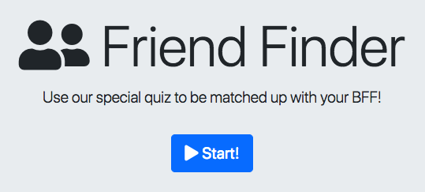

# Friend-Finder

This is a web app utilizing Node.js and Express.js to create a fully-functional survey that will take the user's answers and run a simple algorithm to find their best match in a list of friends stored as a RESTful API. Each time a user completes the survey, they are also added to the API. You can find the deployed app [here.](https://friend-finder-fn.herokuapp.com/)